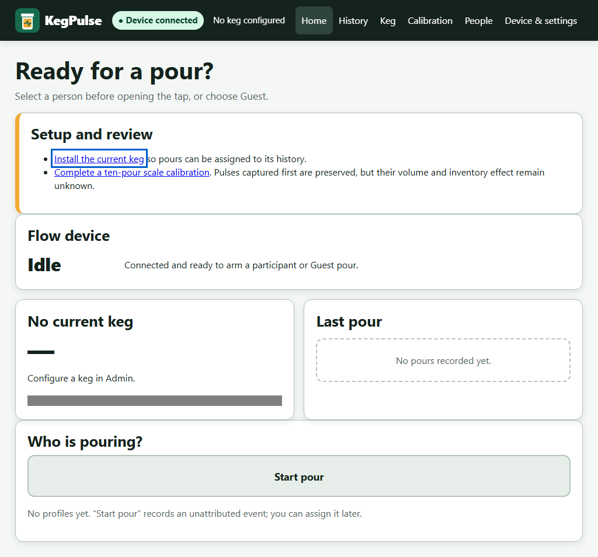

# KegPulse

KegPulse is a local-first, single-tap keg flow monitor. An Arduino Nano-compatible board counts
every accepted flow-meter pulse and speaks the checked KP1 serial protocol; a Python host stores
raw evidence, calibration versions, pour attribution, keg inventory, and audit history in SQLite;
a responsive browser kiosk displays the authoritative host state. It needs no account, cloud,
telemetry, CDN, or internet connection at runtime.

The built-in deterministic simulator provides the complete application experience without
hardware. KegPulse is a personal monitoring tool, not a legal-for-trade meter.



## What v1 does

- Counts attributed and unarmed/unattributed pours without silently losing inventory evidence.
- Keeps raw pulses, device/boot/event identity, keg ID, calibration ID, timestamps, and quality.
- Supports participant profiles, guest pours, later reassignment with audit, and idempotent arm.
- Tracks one open keg as a ledger, including replacement history, signed audited adjustments,
  unknown-volume warnings, and visible negative overrun.
- Guides ten varied scale pours, uses density-aware aggregate calibration, flags robust outliers
  for explicit review, versions factors, and stores weighed drift checks.
- Survives refresh/reconnect through full monotonic snapshots, with visible polling fallback.
- Runs as a touch/keyboard PWA at 800×480, 1024×600, and desktop sizes with local-only assets.
- Defaults to exact loopback; mutations use Host/Origin/CSRF checks, and an optional scrypt PIN
  protects administration. Explicit trusted-LAN mode requires a PIN and exact allowlists.
- Provides atomic SQLite backup, validated command-line restore, CSV/JSON export, rotating JSON
  logs, writable per-user paths, deterministic fault injection, and diagnostics.

## Architecture

```text
D2 / INT0 pulse
  -> Nano ISR + autonomous session machine + retained KP1 result
  -> USB serial / bounded reconnect manager
  -> single-writer coordinator
  -> transactional SQLite commit, then device ACK
  -> full WebSocket snapshot (polling fallback)
  -> replaceable local browser kiosk
```

Firmware owns boot-relative accepted pulse counts and live session state. The host owns durable
records, attribution, calibration, keg selection, and inventory. The browser owns none of them.
See [architecture decisions](docs/DECISIONS.md) and the exact [KP1 protocol](docs/PROTOCOL.md).

## Run the simulator now

Supported source runtimes are CPython 3.11 and 3.12 on Windows x64 and Ubuntu 22.04-compatible
Linux x86_64. The repository path may contain spaces.

Windows PowerShell:

```powershell
powershell -ExecutionPolicy Bypass -File .\scripts\setup-windows.ps1
.\scripts\run-windows.ps1 -Demo
```

Linux:

```bash
./scripts/setup-linux.sh
./scripts/run-linux.sh --demo
```

Or, after activating the environment:

```bash
python -m kegpulse --demo
```

The service prints its URL, normally `http://127.0.0.1:8765`, and opens Edge/Chrome app or kiosk
mode when available, then falls back to the default browser. Add `--no-browser` to print only the
URL. Missing browsers do not terminate measurement. A healthy already-running instance prevents
a duplicate tab.

In demo mode, use Device & settings for deterministic pulses, disconnect/reconnect, reset, and
corrupt/duplicate/delayed frame controls. Demo API/UI controls do not exist in hardware mode and
demo cannot be combined with LAN mode.

## First demo journey

1. Install a test keg from **Keg**.
2. Open **Calibration**, create a water run at `1.000 g/mL`, and capture ten varied samples. The
   simulator's known factor is 5 pulses/mL; use the displayed pulses and representative masses.
3. Review any flag, keep at least seven samples, and activate the factor.
4. Add a person under **People**, return home, select them, add demo pulses, then finish.
5. Add pulses without arming to create a guest/unattributed pour; assign it from **History**.
6. Replace the keg, export CSV/JSON, create a backup, restart with the same data directory, and
   confirm history and inventory remain.

Raw flow captured before calibration is preserved as `needs_review` with unknown volume; it is
never erased or converted later using a guessed factor.

## Run with real hardware

Build and upload only after checking the exact Nano-compatible board/bootloader, sensor voltage,
output type, polarity, pull-up, and D2 wiring:

```powershell
.\.pio-venv\Scripts\platformio.exe run -d firmware -e nanoatmega328
.\.pio-venv\Scripts\platformio.exe run -d firmware -e nanoatmega328 -t upload --upload-port COM5
.\scripts\run-windows.ps1 -SerialPort COM5
```

Linux uses the same source:

```bash
.pio-venv/bin/platformio run -d firmware -e nanoatmega328 -t upload --upload-port /dev/ttyACM0
./scripts/run-linux.sh --serial-port /dev/ttyACM0
```

Without `--serial-port`, the manager enumerates candidates and keeps one only after a valid KP1
handshake. It does not assume the first COM or `/dev` entry is KegPulse. Read
[HARDWARE.md](docs/HARDWARE.md) before wiring/plumbing and [CALIBRATION.md](docs/CALIBRATION.md)
before using measured volume. The current evidence is simulator/native/compile only; no physical
sensor, Nano, Windows COM path, Pi, scale, or liquid rig has been tested.

## Data and privacy

Runtime data is outside the install or frozen bundle, in the per-user directory chosen by
`platformdirs`. Override it deliberately with `--data-dir PATH` or `KEGPULSE_DATA_DIR`.

```text
KegPulse data/
├── kegpulse.db
├── config.json
├── logs/kegpulse.log*
├── backups/
└── exports/
```

The database and backups contain names and consumption history. They are local but not encrypted;
protect the OS account and backup media. Default binding is `127.0.0.1`. Plain-HTTP LAN mode is
for a trusted private network and cannot prevent passive sniffing. See
[SECURITY.md](docs/SECURITY.md) for the threat model and exact controls.

Create a backup in Device & settings. Restore while the host is stopped:

```bash
python -m kegpulse --data-dir "/path/to/KegPulse data" --restore "/path/to/backup.db"
```

The candidate is size/schema/integrity/foreign-key/table validated, an automatic pre-restore
backup is retained, and a failed replacement restores the prior live database.

## Test and package

Developer setup creates a host `.venv` for test/package tools and a separate `.pio-venv` for
PlatformIO. Keeping the firmware toolchain isolated prevents its web-dashboard dependencies from
constraining the patched host-service dependency set. PlatformIO telemetry is disabled by the
scripts and CI:

```powershell
.\scripts\setup-windows.ps1 -Dev
.\.venv\Scripts\python.exe -m playwright install chromium
.\scripts\test-windows.ps1
.\scripts\package-windows.ps1
```

```bash
./scripts/setup-linux.sh --dev
python -m playwright install --with-deps chromium
./scripts/test-linux.sh
./scripts/package-linux.sh
```

Packages are PyInstaller one-folder bundles built natively on their target OS. The scripts run a
frozen demo health/calibration/pour/inventory/external-data/shutdown smoke test and write SHA-256
manifests under `artifacts/`. Windows/Linux x86_64 packages do not support Raspberry Pi ARM64;
use the documented [Pi source deployment](docs/RASPBERRY_PI.md).

## Troubleshooting

- **Port 8765 is occupied:** stop the other service or pass `--port 8766`. KegPulse identifies an
  existing instance before deciding whether to exit or report a conflict.
- **No flow device:** close serial monitors, confirm firmware/cable/driver/permissions, scan ports,
  and compare the printed boot/device IDs. The HTTP kiosk remains responsive while reconnecting.
- **Linux permission denied:** inspect the device group and add only the intended user; the scripts
  print an exact command and never use sudo or weaken permissions automatically.
- **Device reset mid-pour:** do not manually edit the database. Preserve diagnostics; a new boot is
  surfaced as uncertain and cross-boot pulse deltas are never invented.
- **Calibration is inconsistent:** retare, verify density, flow conditions, line, sensor direction,
  wiring, and pulse integrity. Review flags explicitly; do not activate a suspicious factor.
- **Browser is offline:** previously cached shell assets can render, but authoritative API/history
  remains network-only. Restart the local host; stale pour data is intentionally never cached.
- **Corrupt config/database:** copy the data directory first. Config rejects unknown/oversized data;
  restore only a validated KegPulse backup.

## Documentation

- [Execution outcomes](docs/EXECUTION_PLAN.md)
- [Architecture decisions](docs/DECISIONS.md)
- [KP1 protocol](docs/PROTOCOL.md)
- [Hardware and water rig](docs/HARDWARE.md)
- [Calibration and verification](docs/CALIBRATION.md)
- [Data model and migrations](docs/DATA_MODEL.md)
- [Security and privacy](docs/SECURITY.md)
- [Requirement/test traceability](docs/TEST_MATRIX.md)
- [Windows](docs/WINDOWS.md), [Linux](docs/LINUX.md), and
  [Raspberry Pi](docs/RASPBERRY_PI.md) deployment
- [v1 changelog](CHANGELOG.md)
